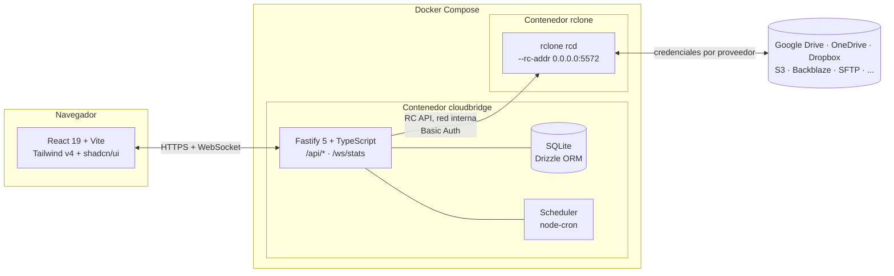

# CloudBridge

Gestor multi-nube selfhosted: un frontend + backend propio sobre **rclone**
(motor de transferencia real), con explorador de dos paneles al estilo
RcloneView, drag & drop, comparación de carpetas y jobs de sincronización
programados. CloudBridge no reimplementa lógica de transferencia — todo se
delega a la [RC API de rclone](https://rclone.org/rc/).

## Arquitectura



- **Backend** (`apps/api`): Fastify 5 + TypeScript. `RcloneClient` es el único
  punto de contacto con la RC API: emite operaciones largas con `_async` y un
  `_group` por ejecución (`run:<id>`), traduce las opciones de transferencia a
  `_config`/`_filter`, y todo `remote:path` pasa antes por un saneador de
  rutas que rechaza `..`.
- **Frontend** (`apps/web`): React 19 + Vite + Tailwind v4 + shadcn/ui +
  TanStack Query/Table + `@dnd-kit/core` para el drag & drop.
- **Compartido** (`packages/shared`): tipos y esquemas `zod` usados por los
  dos lados.
- **Base de datos**: SQLite (WAL) vía Drizzle — usuarios, sesiones, jobs y
  sus destinos (1:N), ejecuciones (`runs`), logs y ajustes.
- **rclone** corre como daemon (`rclone rcd`) en un contenedor aparte, nunca
  expuesto fuera de la red interna de Docker.

### Decisiones que condicionan el código

- **`fs` lleva la ruta completa; `remote` va vacío.** Repartir la ruta entre
  ambos argumentos de `operations/*` solo funciona con backends de raíz fija.
  Un remoto `local` resuelve `disco:` contra el directorio de trabajo del
  daemon, así que `disco:` + `remote=/ruta` falla con "directory not found".
- **El saneador de rutas conserva la barra inicial.** Los remotos `local`
  necesitan rutas absolutas (`disco:/srv/datos`); los almacenes de objetos
  recortan la barra por su cuenta. La protección contra traversal es el
  rechazo de `..`, no la prohibición de la barra.
- **`--bwlimit` no puede ir en `_config`.** rclone lo acepta y lo ignora
  silenciosamente: el limitador de ancho de banda es un único depósito de
  tokens para todo el proceso, controlado por `core/bwlimit`. CloudBridge
  resuelve esto con un `BandwidthManager` que aplica el límite más
  restrictivo entre las ejecuciones activas y restaura el valor global al
  terminar.
- **rclone no tiene pausar/reanudar un job.** *Pausar* llama a `job/stop` y
  conserva los parámetros de la operación; *reanudar* relanza exactamente la
  misma operación — rclone omite los archivos ya idénticos, así que retoma
  a nivel de archivo (se pierde el progreso del archivo que estaba en
  vuelo). Ver [foro de rclone](https://forum.rclone.org/t/how-to-resume-copy-process/14890/3).
- **Drive → Drive server-side.** Copiar entre dos remotos Google Drive añade
  `server_side_across_configs=true` como opción de connection-string; sin
  ella rclone descarga y vuelve a subir en vez de copiar en el servidor. Ver
  [foro de rclone](https://forum.rclone.org/t/drive-shared-with-me-problem/13663/2).

## Instalación

### Requisitos

- Docker y Docker Compose.
- Un LXC/VM Debian 12 (o cualquier host con Docker) detrás de Traefik o
  Cloudflare Tunnel si se expone a Internet.

### Pasos

```bash
git clone <este-repositorio>
cd CloudBridge
cp .env.example .env
```

Edita `.env` y define al menos:

```bash
# Genera valores aleatorios:
openssl rand -hex 16   # -> RCLONE_RC_PASS
openssl rand -hex 32   # -> JWT_SECRET
```

Luego:

```bash
docker compose up -d --build
```

CloudBridge queda escuchando en `http://<host>:${CLOUDBRIDGE_PORT:-8080}`.
El primer arranque crea el usuario administrador con `ADMIN_USER` /
`ADMIN_PASSWORD` de `.env` (solo si no existe ningún usuario todavía —
idempotente).

Verifica que todo esté sano:

```bash
curl http://localhost:8080/api/health
# {"status":"ok","version":"0.1.0","rclone":{"online":true,"version":"v1.xx.x",...}}
docker compose ps   # el puerto 5572 del daemon rclone no debe estar publicado
```

### Desarrollo local

```bash
pnpm install
pnpm run dev          # build de packages/shared + api (tsx watch) + web (Vite)
```

El backend necesita un daemon rclone accesible (`RCLONE_RC_URL`); lo más
simple es levantar solo ese servicio con `docker compose up -d rclone` y
apuntar `RCLONE_RC_URL=http://localhost:5572` en un `.env` local, o correr
`rclone rcd` a mano.

## Cómo añadir un remoto OAuth (Google Drive, OneDrive, Dropbox, Box…)

CloudBridge no tiene navegador, así que el flujo OAuth se hace en dos pasos:

1. En **Remotes → Añadir remoto**, elige el proveedor. El formulario expone
   los campos de `config/providers`; para Drive incluye el toggle
   `shared_with_me`.
2. La UI muestra el comando exacto a ejecutar en una máquina con navegador:
   ```bash
   rclone authorize "drive"
   ```
   Ese comando abre el navegador, pide autorización y termina imprimiendo un
   JSON (`{"access_token":"...","refresh_token":"...","expiry":"..."}`).
3. Pega ese JSON en el campo **Token** del formulario y guarda. CloudBridge lo
   envía a `config/create` junto con el resto de parámetros.

Los secretos guardados nunca se vuelven a mostrar en claro: al editar un
remoto aparecen enmascarados y solo se reemplazan si escribes un valor nuevo.

**Drive "Compartido conmigo":** si necesitas ver tanto tus archivos como los
compartidos, crea dos remotos Drive — uno con `shared_with_me = true` y otro
sin él — en vez de depender de que un solo remoto muestre ambos a la vez
(limitación conocida de rclone). Al copiar entre dos remotos Drive,
CloudBridge añade automáticamente `server_side_across_configs=true` para que
la copia sea del lado del servidor.

Para proveedores no-OAuth (S3, WebDAV, SFTP, FTP, SMB, Backblaze B2…) el
formulario pide directamente los campos requeridos, sin pasos adicionales.

## Variables de entorno

| Variable | Descripción | Por defecto |
|---|---|---|
| `CLOUDBRIDGE_PORT` | Puerto del host publicado hacia el contenedor `cloudbridge` | `8080` |
| `RCLONE_RC_USER` / `RCLONE_RC_PASS` | Credenciales de la RC API de rclone (Basic Auth) | — (obligatorio) |
| `RCLONE_LOG_LEVEL` | Nivel de log del daemon rclone | `INFO` |
| `JWT_SECRET` | Clave de firma de la sesión (≥32 caracteres) | — (obligatorio) |
| `SESSION_TTL_HOURS` | Duración de la sesión | `12` |
| `COOKIE_SECURE` | Cookie `Secure`; actívalo si se sirve por HTTPS | `false` |
| `TRUST_PROXY` | Confía en `X-Forwarded-For` (necesario detrás de Traefik/Cloudflare) | `true` |
| `ADMIN_USER` / `ADMIN_PASSWORD` | Credenciales del admin inicial (solo se usan si no hay usuarios aún) | `admin` / — |
| `LOG_LEVEL` | Nivel de log de la aplicación (JSON a stdout) | `info` |
| `TZ` | Zona horaria por defecto del contenedor y del scheduler | `UTC` |

Variables adicionales de `apps/api` para desarrollo local sin Docker están
documentadas en `apps/api/src/config/env.ts`.

## Seguridad

- El daemon rclone (`rcd`) no publica ningún puerto en el host: solo es
  alcanzable desde la red interna de Docker, y siempre requiere
  autenticación (nunca `--rc-no-auth`).
- Contraseñas con argon2id; sesión como JWT en cookie `httpOnly`, con una
  fila por token en SQLite para poder revocar en `logout` sin esperar a que
  expire.
- Rate limiting en `/api/auth/login` (solo cuenta los intentos fallidos).
- Todas las rutas de archivo pasan por un saneador común que rechaza
  traversal (`..`) antes de construir cualquier `remote:path`.
- `sync` con borrado en destino exige escribir el nombre del job (o la ruta
  de destino, en el Explorer) para confirmar — tanto en la UI como,
  independientemente, en el backend.
- Si el daemon rclone está caído, la UI muestra un banner y desactiva las
  acciones en vez de fallar silenciosamente.
- Un job en ejecución que se interrumpe por un reinicio del contenedor se
  marca como `interrupted` en el historial al arrancar de nuevo.
- Logs estructurados en JSON hacia stdout, listos para Loki/Promtail.

## Tests

### Unitarios (Vitest)

```bash
pnpm --filter @cloudbridge/api test
```

Cubren el cliente de la RC API (con `fetch` mockeado: `_async`, `_group`,
`_config`/`_filter`, manejo de errores 401/404/red caída), el saneador de
rutas y el mapeo de opciones de transferencia (incluida la exclusión
deliberada de `BwLimit` de `_config`).

### End-to-end (Playwright)

El E2E ejercita el flujo real "crear job → ejecutar → ver historial" contra
un stack en marcha, usando dos remotos `local` (sin credenciales de nube):

```bash
docker compose up -d
docker compose exec rclone sh -c \
  'mkdir -p /cache/e2e-src /cache/e2e-dst && echo hola > /cache/e2e-src/file.txt'

# Crea los remotos e2e-src / e2e-dst apuntando a esas rutas, por ejemplo
# desde la UI en Remotes, o con la API:
curl -u admin:$ADMIN_PASSWORD -X POST localhost:8080/api/remotes \
  -H 'content-type: application/json' \
  -d '{"name":"e2e-src","type":"local","parameters":{}}'
curl -X POST localhost:8080/api/remotes \
  -H 'content-type: application/json' \
  -d '{"name":"e2e-dst","type":"local","parameters":{}}'

cd apps/web
CLOUDBRIDGE_E2E_URL=http://localhost:8080 \
CLOUDBRIDGE_E2E_USER=admin \
CLOUDBRIDGE_E2E_PASSWORD=<tu ADMIN_PASSWORD> \
pnpm exec playwright test
```

## Estructura del monorepo

```
apps/api          Backend Fastify + cliente rclone + scheduler + WebSocket
apps/web           Frontend React + Vite
packages/shared     Tipos y esquemas zod compartidos
Dockerfile          Build multi-stage (deps → build → runtime)
docker-compose.yml  Servicios cloudbridge + rclone
```
